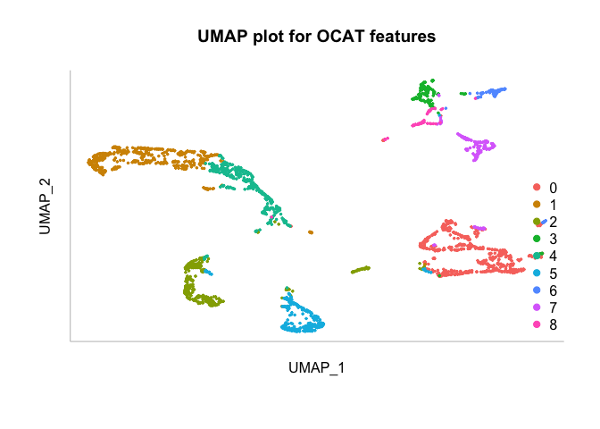
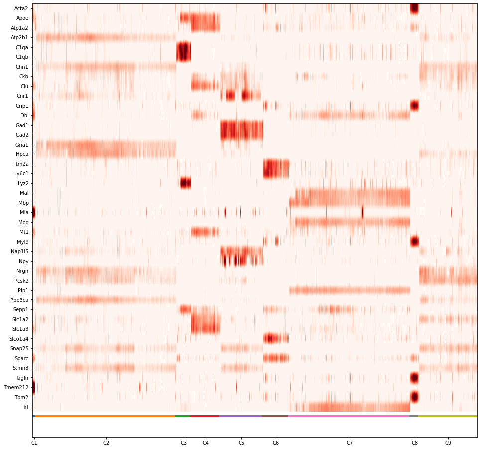

In this page, we demonstrated how rOCAT do clustering with the Zeisel et al. (2015) dataset. The dataset using 3,005 cells and 4,412 genes in the mouse somatosensory cortex and hippocampal CA1 region and can be download [here](https://github.com/bowang-lab/OCAT/blob/master/vignettes/Clustering/Test_5_Zeisel.mat).

## load package

    library(rOCAT)
    library(reticulate)

## import data

    # load Test Zeisel data
    data1 <- R.matlab::readMat('../../data/Test_5_Zeisel.mat')

    # extract the gene feature matrix and make it saved as a sparse matrix
    in_X <- as(data1$in.X, 'dgCMatrix')

    # extract the labels
    labels_true <- as.vector(data1$true.labs)

    # the input data should be a vector of datasets c(datasets1,dataset2,...)
    data_list <- c(in_X)

## run OCAT pipeline

    ZW <- run_OCAT(data_list, m_list=list(50), dim=30, 
                    p=0.3, log_norm=TRUE, l2_norm=TRUE, if_inference=FALSE, 
                    random_seed=42)
    #> [1] "Starting Dimension Reduction"
    #> [1] "Dimension Reduction Finished"

## clustering and evaluation

    labels_pred <- evaluate_clusters(np_array(ZW),num_cluster = length(unique(labels_true)))

    # get the NMI score between our predicted cell type and the true cell type 
    normalized_mutual_info_score(labels_true, labels_pred)
    #> [1] 0.7884375

    # Calculate and Display the UMAP plot
    umap <- run_UMAP(ZW)
    plot_UMAP(umap,labels_true,labels_pred,title='UMAP plot for OCAT features')

## Gene prioritization

    gene_label <- data1$label2[1,]
    preprocess_in_X <- preprocess(data_list,TRUE,TRUE)[[1]]
    gene_df_figure  <- calculate_marker_gene(t(preprocess_in_X),labels_pred,5,gene_label)
    gene_df  <- gene_df_figure[[1]]
    fig <- gene_df_figure[[2]]

